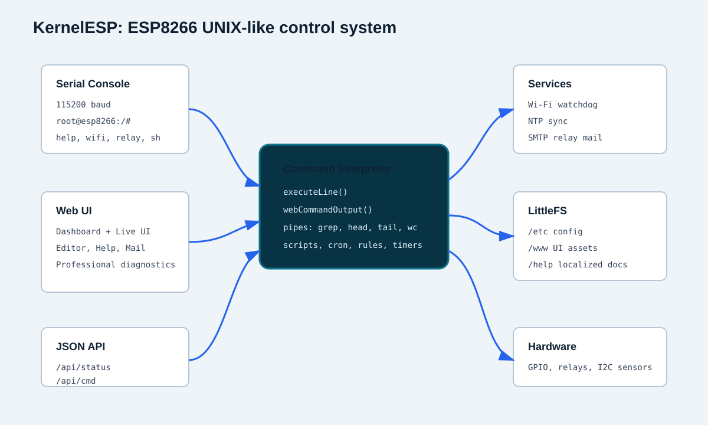
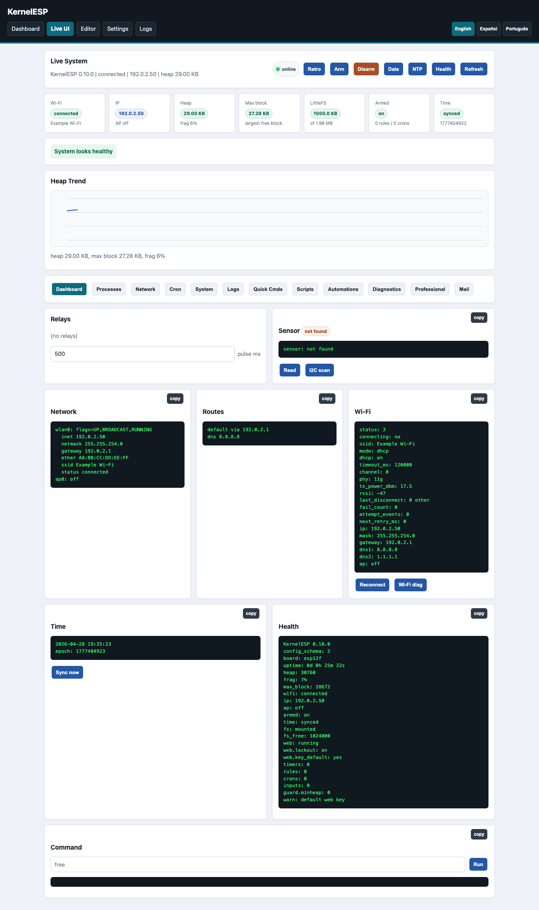
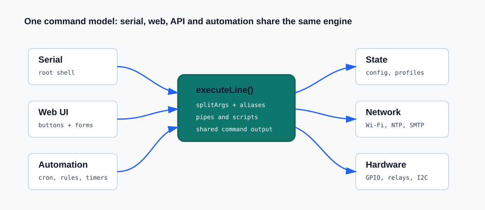
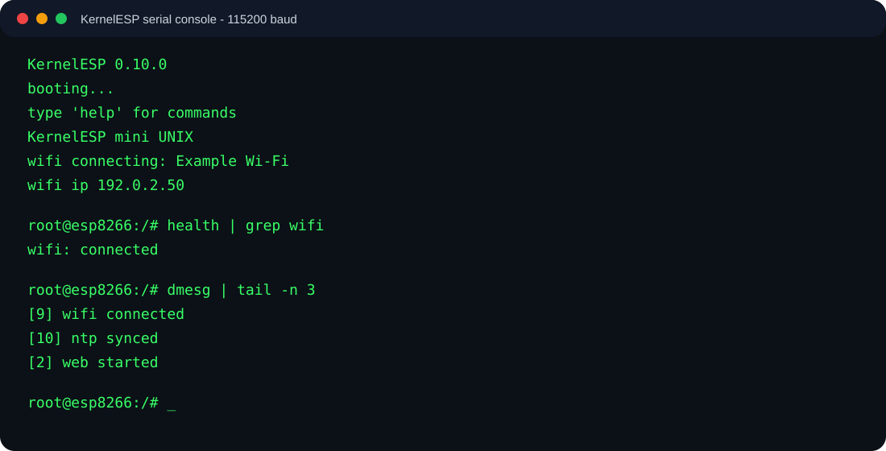

# KernelESP

KernelESP is a small ESP8266 firmware that turns the board into a tiny networked control system with a UNIX-like serial shell, a password-protected web console, LittleFS storage, relay control, scheduled jobs, sensor rules, scripts, logs, NTP time and a JSON API.

Current firmware version: `0.10.0`.

## Lineage, Attribution And License

KernelESP is inspired by and includes source code copied/adapted from
[KernelUNO](https://github.com/Arc1011/KernelUNO), a lightweight UNIX-like shell
for Arduino UNO created by
[Arc1011](https://github.com/Arc1011).

KernelUNO established the original spirit of a tiny Arduino shell with familiar
UNIX-style commands. KernelESP keeps that idea and extends it for ESP8266 with
persistent LittleFS storage, Wi-Fi, a web UI, JSON API, automations, mail
alerts, localized web help, diagnostics and release tooling.

KernelUNO is distributed under the BSD 3-Clause License. KernelESP keeps the
same license family and preserves the original copyright notice for copied or
adapted portions. See `LICENSE`, `NOTICE` and `THIRD_PARTY_NOTICES.md`.

## Screenshots









More screenshots and diagrams:

```text
docs/SCREENSHOTS.md
```

## What It Can Do

- Interactive serial shell with commands such as `ls`, `cat`, `head`, `tail`, `grep`, `find`, `wc`, `du`, `df`, `mount`, `which`, `whoami`, `id`, `groups`, `who`, `w`, `ps`, `pgrep`, `pidof`, `kill`, `jobs`, `dmesg`, `free`, `uname`, `date`.
- Lightweight pipes for common text workflows: `cmd | grep text | head -n 5 | tail -n 5 | wc -l | tee /path/file`.
- LittleFS file system with `/etc`, `/home`, `/var/log`, `/www`, `/etc/boot.sh` and `/etc/motd`.
- Web UI with login, dashboard, richer Live UI, command runner, script editor, diagnostics, setup wizard, profiles, logs, settings, backup and a Professional panel.
- Static web assets served from `/www`, so CSS/JS can be changed without recompiling.
- Relay control by name, GPIO and active-low/active-high mode.
- Timers, cron jobs, scenes, persistent state, digital inputs and sensor rules for automation.
- Tiny C-like automation language with `if (...)`, `&&`, `||`, `!`, blocks, `else`, persistent variables, constants and persistent functions.
- Debian-like shell helpers: `test`, `basename`, `dirname`, `source`, `run`, `repeat`, `logger`, `onboot`, `pkg`, `printenv`, `setenv`, `crontab`, `systemctl`, `ifconfig`, `ip`.
- RAM-generated pseudo `/proc`, `stat`, `journalctl`, `dryrun`, `profile` snapshots and module `export`.
- Professional support commands: `diag` for read-only diagnostic bundles and `board` for profile/pin guidance.
- Friendly automation wrappers: `schedule` and `climate`.
- Native rule cooldown and range/hysteresis rules.
- NTP time sync and `date`.
- BME280/BMP280 support for temperature, pressure and humidity where available.
- Basic PCF8574 and MCP23017 I2C GPIO expander commands.
- Non-blocking Wi-Fi save/autoconnect, hostname and simple TCP/HTTP diagnostics.
- Wi-Fi watchdog and fallback setup AP so serial remains usable while network recovery happens in the background.
- Backup export of important LittleFS configuration files.
- Flash-wear-aware logging: `dmesg` in RAM, persistent logs opt-in with `log flash on`.
- Web authentication lockout after repeated failed attempts.

## Project Layout

```text
KernelESP/
  KernelESP.ino              Firmware source
  README.md                  Project overview
  LICENSE                    BSD 3-Clause License
  NOTICE                     KernelUNO attribution and project lineage
  THIRD_PARTY_NOTICES.md     Third-party source-code notices
  CONTRIBUTING.md            Contribution rules and verification workflow
  SECURITY.md                Security assumptions and reporting guidance
  CHANGELOG.md               Release history
  docs/
    USER_MANUAL.md           End-user manual and command examples
    COMMAND_REFERENCE.md     Full command reference
    AUTOMATION_LANGUAGE.md   C-like automation language, variables, blocks and functions
    PROFESSIONAL_OPERATIONS.md Release, support and production workflow
    AUTOMATION_COOKBOOK.md   Relay, timer, cron, rule and sensor recipes
    WEB_AND_API.md           Web UI, JSON API and static assets
    PROGRAMMER_MANUAL.md     Architecture and contributor guide
    HARDWARE.md              ESP8266 pins, relays, sensors and memory notes
    GITHUB_RELEASE_CHECKLIST.md Pre-publish checklist for GitHub
    SCREENSHOTS.md           Screenshot gallery and architecture diagrams
    PROJECT_STATE.md         Current build, upload and continuation notes
  book/
    KernelESP_Beginners_Book.pdf Beginner-friendly illustrated PDF guide
    assets/cover-hero.png    Book cover image source
  examples/
    boot.sh                  Example boot script
    relay_pulse.sh           Example relay script
    climate_rules.txt        Example sensor automation commands
    cron_examples.txt        Example cron commands
    mail_workflows.txt       Example SMTP alert and daily health workflows
  data/www/
    index.html               Live UI application shell
    app.js                   Live UI JavaScript core, served from LittleFS
    app2.js                  Live UI panel builder
    app3.js                  Live UI cron/system/log panel builder
    app3b.js                 Live UI refresh loop, API timeout and output routing
    app3c.js                 Live UI form handlers and clock validation
    app3d.js                 Live UI status cards, alerts and heap chart
    app4.js                  Live UI relay rendering and command buttons
    app4b.js                 Live UI automation builder and browser command history
    app5.js                  Live UI network configuration panel
    app6.js                  Live UI polish: online indicator, retro theme, copy buttons
    app7.js                  Live UI ops panel, templates and console keyboard helpers
    app8.js                  Live UI script editor improvements
    app8b.js                 Live UI file browser and script save/run helpers
    app9.js                  Live UI automation view and diagnostics
    app10.js                 Live UI professional panel logic
    app11.js                 Live UI professional panel markup/styles
    app12.js                 Live UI mail alerts panel markup
    app13.js                 Live UI mail alerts actions and workflow builders
    style.css                Current web stylesheet for LittleFS
    style2.css               Additional responsive Live UI styling
  tools/
    compile.sh               Compile with arduino-cli
    upload.sh                Upload firmware to the ESP8266
    upload-assets.sh         Upload /www and /help LittleFS assets
    verify.sh                Run local syntax, encoding and compile checks
    smoke-http.sh            Run read-only HTTP/API smoke tests
    stability-http.sh        Run repeated HTTP/API stability checks
    wifi-sdkreset.sh         Send wifi sdkreset --yes over serial
    release.sh               Build a release directory and tarball
    diagnostic-bundle.sh     Export a support bundle from a running ESP
    ota-preflight.sh         Check update readiness without enabling OTA
    serial-monitor.sh        Open a serial monitor
    build-beginners-book.py  Generate the PDF book
    requirements-book.txt    Python dependencies for the PDF book
  .github/workflows/         Lightweight static checks for pull requests
```

## Quick Start

Compile:

```sh
tools/compile.sh
```

Upload. The script auto-detects common ESP serial ports; pass a port only when
auto-detection finds the wrong adapter:

```sh
tools/upload.sh
tools/upload.sh /dev/cu.usbserial-02094OMK
```

After a successful serial upload, `tools/upload.sh` automatically sends
`wifi sdkreset --yes` to clear stale ESP8266 SDK Wi-Fi state before the board
reconnects. Set `POST_UPLOAD_WIFI_SDKRESET=0` only when you explicitly want to
skip that recovery step.

Open the web UI. Get the current address from serial with `wifi status` or `web status`.

```text
http://<esp-ip>/
```

If station Wi-Fi fails and fallback AP is enabled, connect to `KernelESP-Setup` and use:

```text
http://192.168.4.1/
```

Run a command over the API:

```sh
curl -G 'http://<esp-ip>/api/cmd' \
  --data-urlencode 'key=admin' \
  --data-urlencode 'c=uname'
```

Try pipes from serial, the web command runner or `/api/cmd`:

```text
health | grep wifi
dmesg | tail -n 5
health | wc -l
health | tee /home/health.txt
```

## Useful First Commands

```text
help
help relay
uname
free
df
wifi status
date
ls /
cat /etc/motd
boot show
jobs
health
diag
board
```

## Documentation

Read these in order:

1. `docs/USER_MANUAL.md`
2. `docs/COMMAND_REFERENCE.md`
3. `docs/AUTOMATION_COOKBOOK.md`
4. `docs/WEB_AND_API.md`
5. `docs/HARDWARE.md`
6. `docs/PROFESSIONAL_OPERATIONS.md`
7. `docs/PROGRAMMER_MANUAL.md`
8. `docs/GITHUB_RELEASE_CHECKLIST.md`

## Before Publishing To GitHub

- Keep the BSD 3-Clause License, KernelUNO attribution notice and third-party
  notices.
- Do not commit `.venv/`, `build/`, `dist/`, `diagnostics/`, `.DS_Store`,
  `.env` or generated logs.
- Search for real Wi-Fi keys, web keys, private SMTP details and local network
  addresses before pushing.
- Run:

```sh
tools/verify.sh
SKIP_COMPILE=1 tools/verify.sh
```

## Current Memory Profile

Last verified build for `0.10.0`:

```text
RAM global: 42816 / 80192 bytes, 53%
IRAM:       62567 / 65536 bytes, 95%
Flash app: 489440 / 1048576 bytes, 46%
LittleFS:  about 1.00 MB free after web/help assets on the tested 4 MB module
Runtime heap: around 30-33 KB free in normal web use
```

IRAM is the tightest resource. Prefer LittleFS-hosted CSS/JS/HTML and compact firmware functions. Persistent logging is disabled by default to avoid unnecessary flash wear; enable it only when needed.
