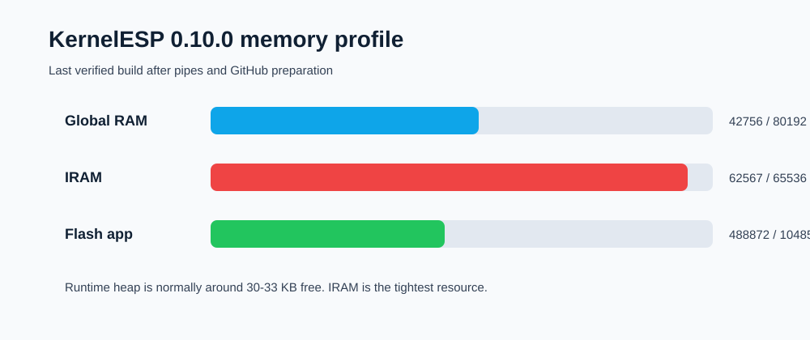
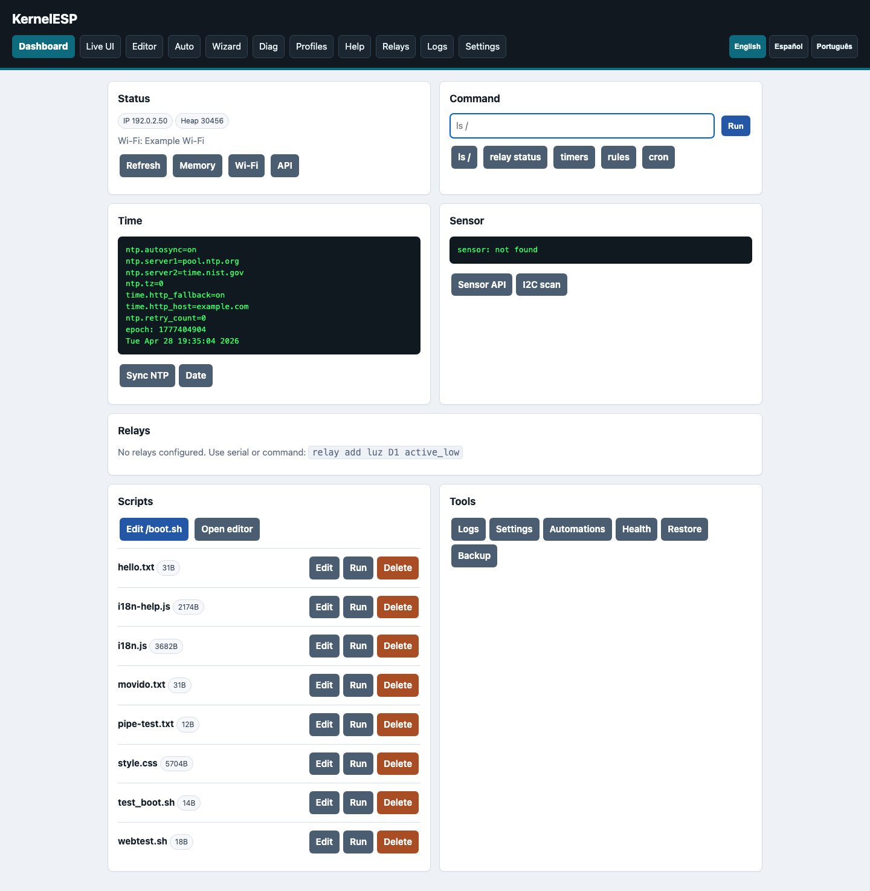
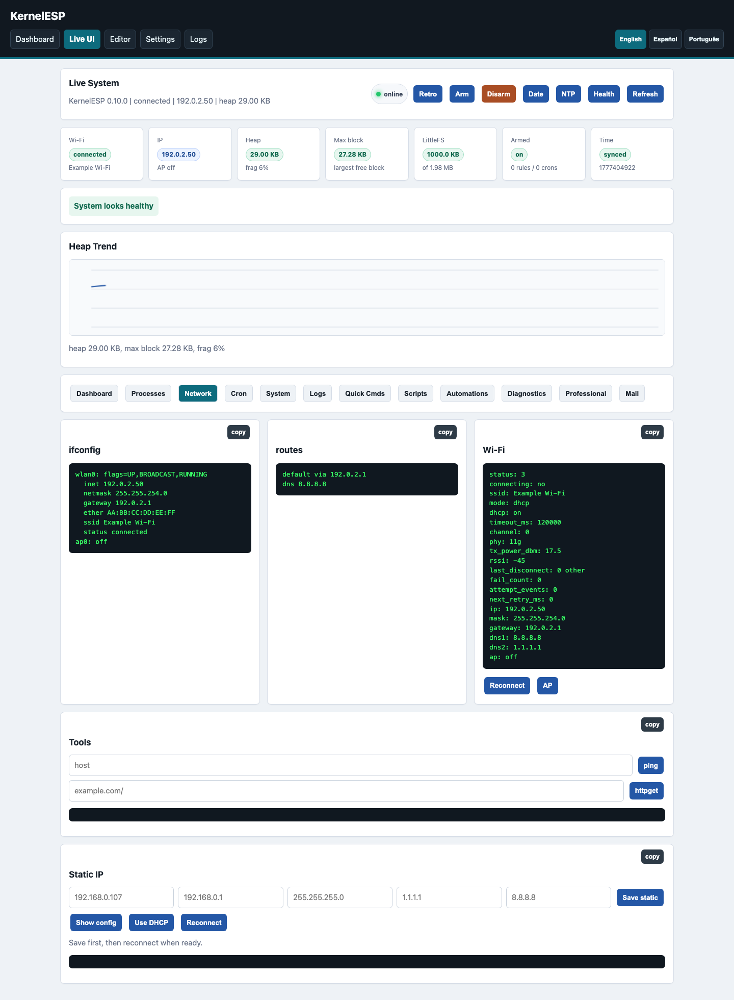
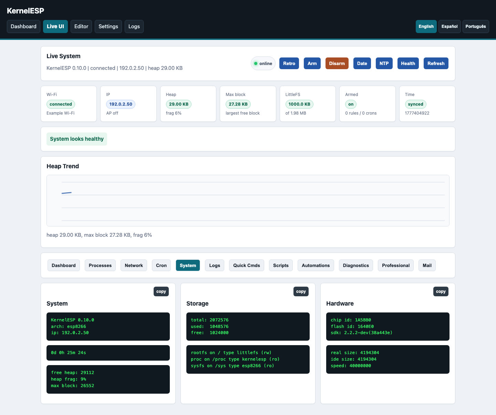
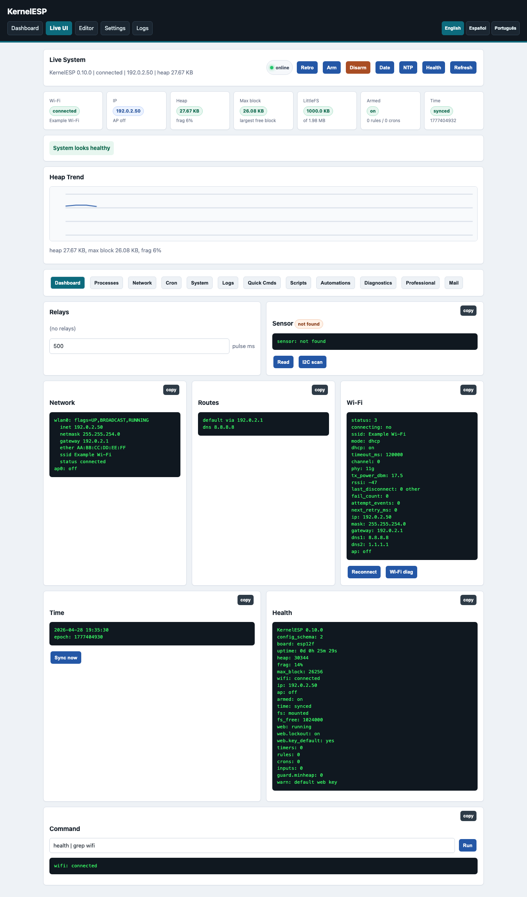
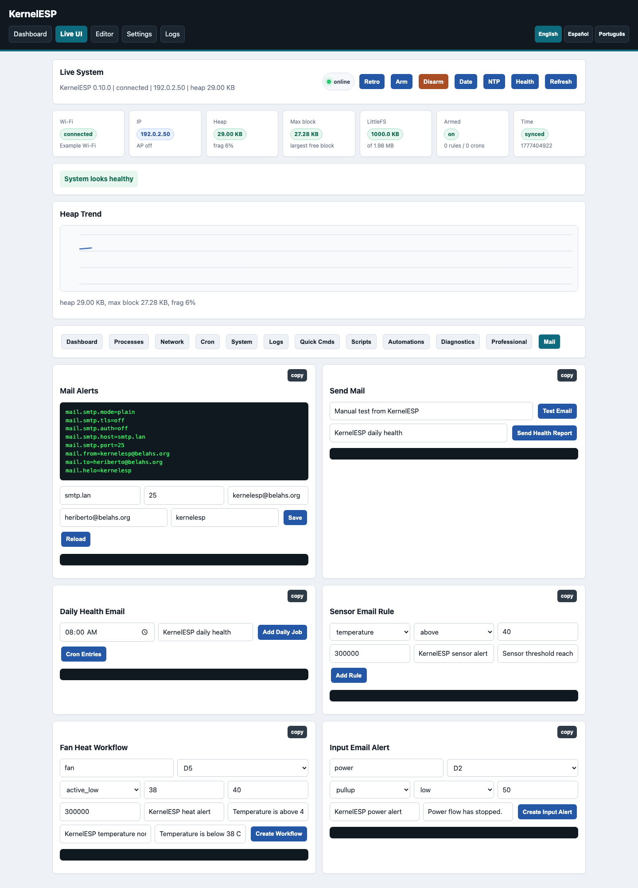
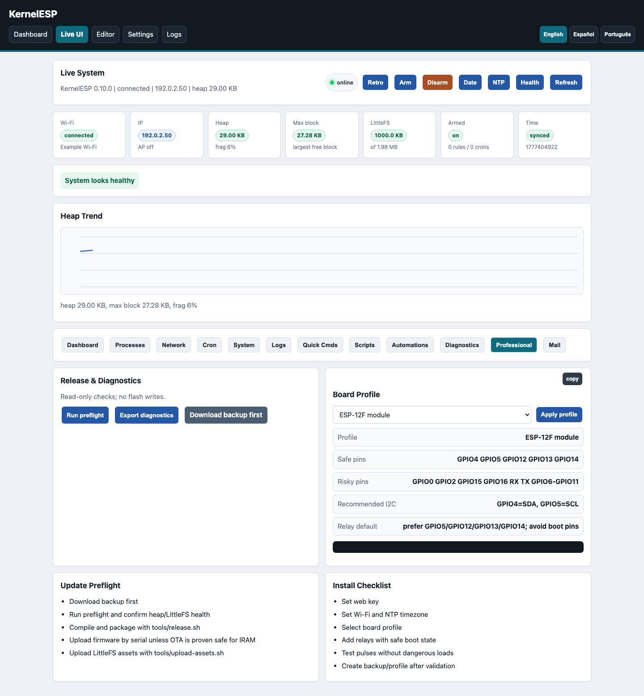
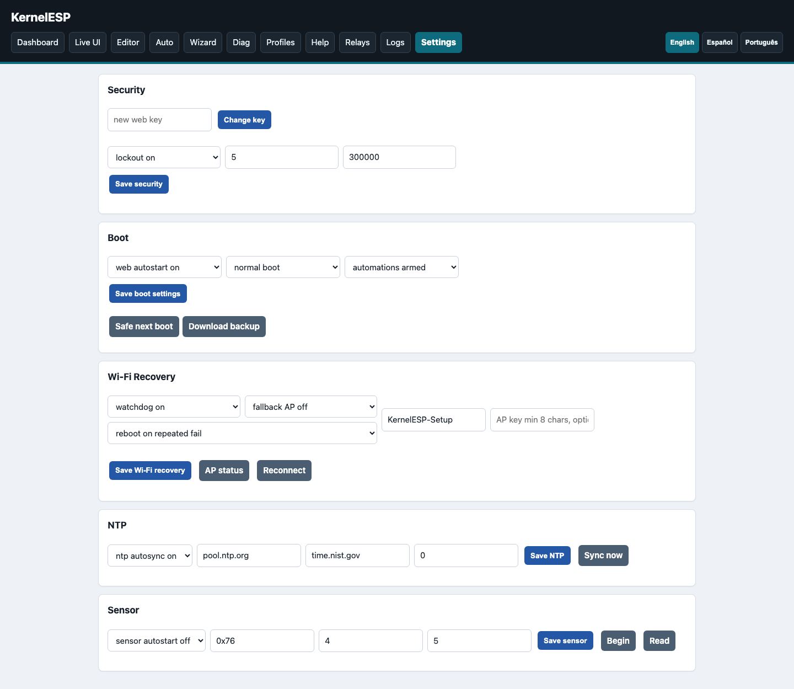
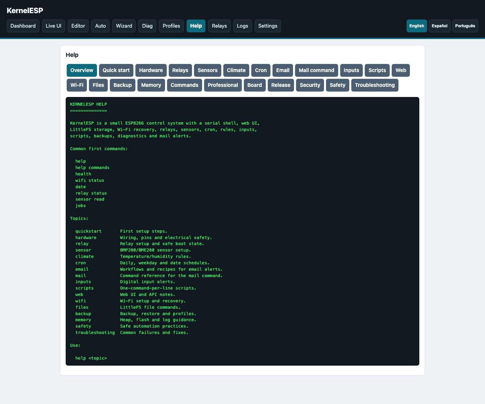
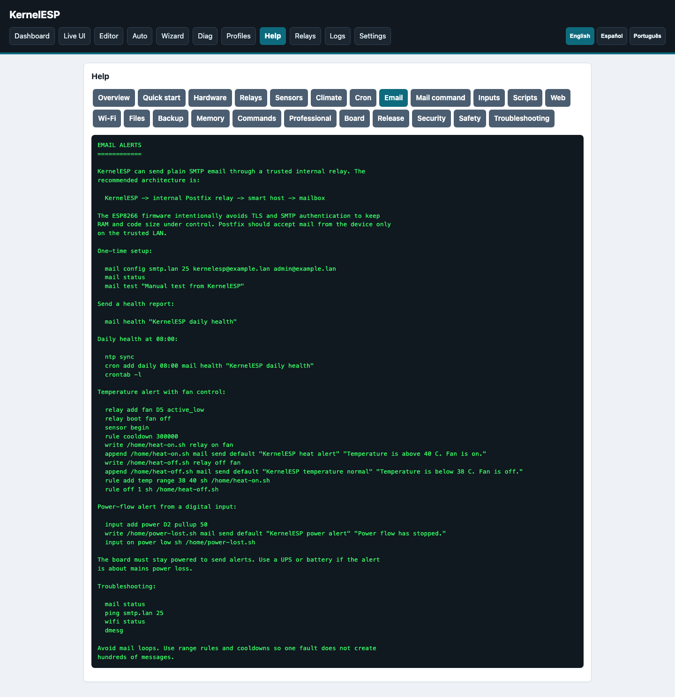

# KernelESP Screenshots And Diagrams

The screenshots below were captured from a live ESP8266 board. Network
identifiers were masked before saving the images.

## Architecture

## Web UI

### Dashboard

### Live System Dashboard

### Live Network

### Live System

### Command Runner With Pipes

### Mail Workflows

### Professional Panel

### Settings

## Help

## Console

